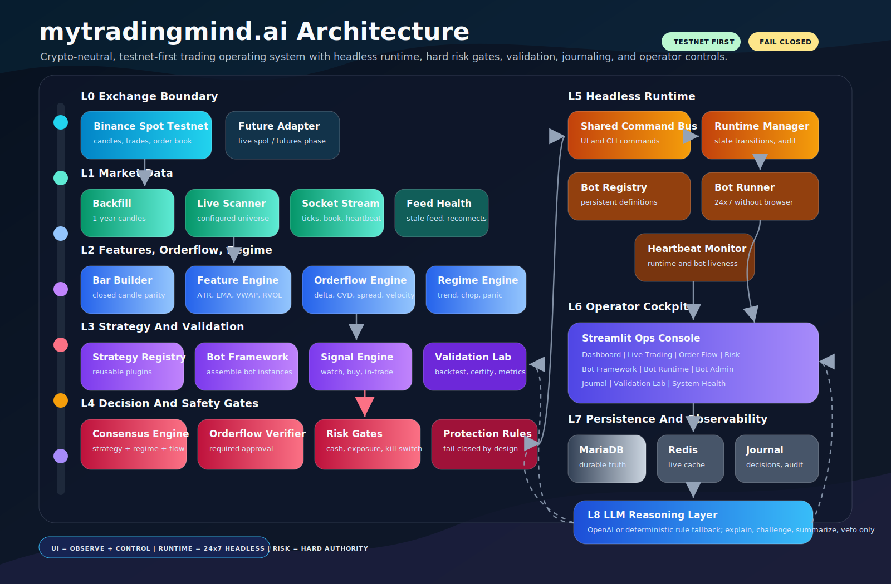

# mytradingmind.ai

mytradingmind.ai is a crypto-neutral, testnet-first trading operations platform for Binance Spot workflows. It combines a Streamlit operations console, strategy-agnostic bot framework, persistent MariaDB state, risk gates, journaling, validation, and Binance market-data scanning.

The system is designed around safety-first operation:

- strategies do not call the exchange directly
- risk gates are hard blocks, not advisory labels
- bot state and journal events persist outside the browser session
- MariaDB is the operational source of truth when enabled
- dashboard screens are selection-based, not tied to one coin
- live-money trading remains gated until testnet certification is complete

## High-Level Architecture



Detailed architecture notes:

[Architecture Overview](docs/ARCHITECTURE.md)

## Current Screens

- Dashboard
- Live Trading
- Order Flow
- Risk
- Bot Framework
- Bot Runtime
- Bot Admin
- System Health
- Journal
- Validation Lab

## Quick Start On Windows

```powershell
python -m venv .venv
.\.venv\Scripts\Activate.ps1
pip install -e ".[dev]"
pytest
copy .env.example .env
python scripts\init_db.py
python scripts\start_dashboard.py
```

Open:

```text
http://127.0.0.1:8501
```

## Local MariaDB

The application uses schema/database `bots` and table prefix `myts_bot_table_`.

Example local app URL:

```text
AEGIS_DATABASE_URL=mysql+pymysql://tradeuser:<password>@127.0.0.1:3307/bots
AEGIS_DATABASE_SCHEMA=bots
AEGIS_DATABASE_ENABLED=true
```

Initialize tables:

```powershell
python scripts\init_db.py
```

## Market Data And Metrics

Backfill Binance public candles:

```powershell
python scripts\binance_backfill.py --symbols ETH/USDT,SOL/USDT,BNB/USDT,XRP/USDT,ADA/USDT,DOGE/USDT,LINK/USDT,AVAX/USDT,TRX/USDT
```

Generate replay metrics into reports and MariaDB:

```powershell
python scripts\generate_top10_metrics.py --database
```

Run institutional readiness and deterministic stress checks:

```powershell
python scripts\institutional_check.py --run-tests
python scripts\production_readiness_stress.py
```

Run the Binance websocket stream used by the Live Trading screen:

```powershell
python scripts\binance_stream.py --interval 1m --write-seconds 2
```

## Logs

Runtime logs are written under `logs/`:

- `logs/mytradingmind.log`
- `logs/streamlit_stdout.log`
- `logs/streamlit_stderr.log`

Database URLs are password-redacted in diagnostics.

## Ubuntu / DigitalOcean

Use the deployment guide:

[Ubuntu Droplet Deployment](docs/UBUNTU_DROPLET_DEPLOYMENT.md)

Short version:

```bash
chmod +x setup.sh
./setup.sh
cp deploy/ubuntu.env.example .env
nano .env
mkdir -p data reports logs backups
docker compose -f deploy/docker-compose.yml --env-file .env up -d --build mariadb redis
docker compose -f deploy/docker-compose.yml --env-file .env run --rm mytradingmind_dashboard python scripts/init_db.py
docker compose -f deploy/docker-compose.yml --env-file .env up -d --build mytradingmind_runtime mytradingmind_dashboard scanner
```

## GitHub Upload

Use:

[GitHub Upload Guide](docs/GITHUB_UPLOAD_GUIDE.md)

Do not commit `.env`, API keys, local passwords, logs, or virtual environments.

## Institutional Readiness

Read:

[Institutional Readiness Check](docs/INSTITUTIONAL_READINESS.md)

Current classification:

- Paper/testnet operation: certified for continued use and hardening
- Live-money operation: not certified until the listed live-mode gates pass

Keep:

```text
AEGIS_MODE=PAPER_MODE
AEGIS_BINANCE_TESTNET=true
```

until testnet order placement, protection verification, reconciliation, restart recovery, backup/restore, and kill-switch drills are complete.
