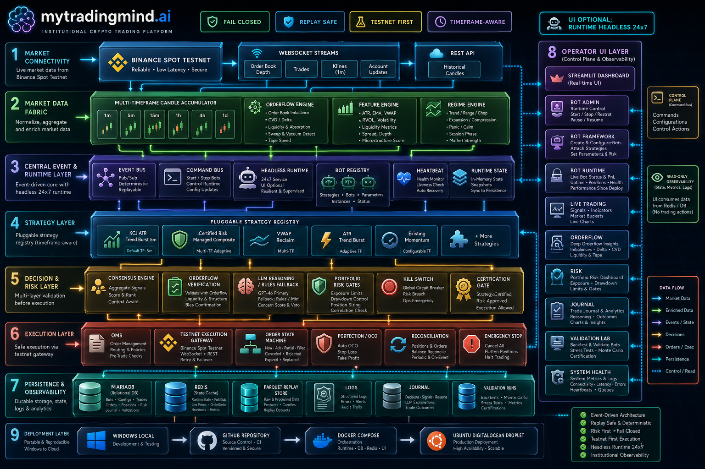

# mytradingmind.ai

mytradingmind.ai is an educational, testnet-first crypto trading operations platform. It is built to help you study how an institutional-style trading system is organized: market data, bot lifecycle, strategy validation, risk controls, journaling, and observability.

> Educational use only. This project is not financial advice. Do not use the included strategies for real-money production trading. Strategies must be independently reviewed, tested, risk-approved, and legally/commercially assessed before any live deployment.

## Releases

- `v1.0`: baseline app release preserved from the original `main` branch before the Bot Operations Platform upgrade.
- `v1.2.6`: current main release with Bot Management, runtime cockpit, Trade Management, journal analysis, headless runtime scripts, Ubuntu install/upgrade hardening, Docker runtime entrypoint packaging, dashboard scan-file resilience, runtime-state trade classification, security/RBAC foundations, AAPIF strategy evolution, and persisted bot trade-state recovery.

Use either release independently:

```bash
git clone https://github.com/kaniampurath/mytradingmind-ai.git
cd mytradingmind-ai
git checkout v1.0   # baseline
git checkout v1.2.6 # current main release
```

## What It Does

- Watches Binance Spot Testnet market data
- Accumulates websocket candles across multiple timeframes
- Lets you create and manage bot instances
- Runs a dashboard independently from the headless runtime
- Backtests and stress-tests strategy modules
- Persists bot state, risk settings, validation runs, and journal events
- Shows live bot/runtime status through an operator console
- Keeps risk gates and runtime controls separate from strategy code

## Technology Architecture



The system is split into independent layers:

- **Market Connectivity**: Binance Spot Testnet websocket, REST candles, order book, trades, klines
- **Market Data Fabric**: multi-timeframe candles, features, orderflow, regime context
- **Runtime Layer**: headless runtime, command bus, bot registry, runtime state, heartbeat
- **Strategy Layer**: pluggable strategy registry and strategy-specific default timeframes
- **Decision and Risk Layer**: consensus, risk gates, LLM/rules reasoning, kill-switch controls
- **Execution Layer**: testnet execution gateway, OMS, protection, reconciliation
- **Persistence Layer**: MariaDB, Redis-ready state, Parquet feature files, logs, journal, validation runs
- **Operator UI**: Streamlit dashboard, Bot Admin, Bot Framework, Bot Runtime, Risk, Journal, Validation Lab
- **Deployment Layer**: Windows local development, GitHub, Docker Compose, Ubuntu/DigitalOcean

Detailed notes: [Architecture Overview](docs/ARCHITECTURE.md)

## Screens

- Dashboard
- Bot Management
  - Bot Framework
  - Bot Runtime
  - Bot Admin
  - Validation Lab
- Trade Management
- Order Flow
- Risk
- System Health
- Journal

Live Trading and SignalFlow are now dashboard panels rather than standalone navigation screens.

## Safety First

The project is intentionally designed to fail closed:

- Strategies do not call the exchange directly
- Risk gates are hard blocks, not advisory labels
- Bot state survives browser refreshes and dashboard restarts
- Headless runtime can run without Streamlit
- Dashboard is an operator/control surface, not the trading loop
- Binance Testnet is the default operating assumption
- Live-money operation is not certified

Keep these settings until you have completed testnet-only validation:

```text
AEGIS_MODE=PAPER_MODE
AEGIS_BINANCE_TESTNET=true
```

## Quick Start: Windows

```powershell
git clone https://github.com/kaniampurath/mytradingmind-ai.git
cd mytradingmind-ai

python -m venv .venv
.\.venv\Scripts\Activate.ps1
pip install -e ".[dev]"

copy .env.example .env
python scripts\init_db.py
python scripts\enterprise_security_test.py --concurrent-users 10
pytest
```

Start the dashboard:

```powershell
python -m mytradingmind.dashboard start
```

Open:

```text
http://127.0.0.1:8501
```

Start the headless runtime separately:

```powershell
python -m mytradingmind.runtime start --mode headless
```

You can also start/stop runtime and bots from **Bot Admin** inside the dashboard.

## Quick Start: Ubuntu / DigitalOcean

```bash
git clone https://github.com/kaniampurath/mytradingmind-ai.git
cd mytradingmind-ai

chmod +x setup.sh
./setup.sh

nano .env

mkdir -p data reports logs backups
python3 scripts/validate_env.py --env-file .env
docker compose -f deploy/docker-compose.yml --env-file .env up -d --build mariadb redis
docker compose -f deploy/docker-compose.yml --env-file .env run --rm mytradingmind_dashboard python scripts/init_db.py --print-tables
docker compose -f deploy/docker-compose.yml --env-file .env run --rm mytradingmind_dashboard python scripts/enterprise_security_test.py --concurrent-users 10
docker compose -f deploy/docker-compose.yml --env-file .env run --rm mytradingmind_dashboard python scripts/binance_backfill.py --transport python
docker compose -f deploy/docker-compose.yml --env-file .env up -d --build mytradingmind_runtime mytradingmind_dashboard scanner
scripts/install_sanity_ubuntu.sh
```

Open the dashboard:

```text
http://YOUR_DROPLET_IP:8501
```

Full guide: [Ubuntu Droplet Deployment](docs/UBUNTU_DROPLET_DEPLOYMENT.md)

Operational diagnostics:

```bash
python3 scripts/runtime_diagnostics.py --dashboard-url http://127.0.0.1:8501/_stcore/health
scripts/reboot_verify_ubuntu.sh
```

Release notes and rollback guidance: [Releases](docs/RELEASES.md)

## Security And User Management

Database initialization automatically creates the identity, RBAC, subscription, session, audit, and admin-bootstrap tables. Default roles are `BASIC_USER`, `POWER_USER`, and `ADMIN`; default permissions and screen grants are seeded idempotently.

Passwords and bootstrap credentials are stored only as salted PBKDF2 hashes. To enable first-admin bootstrap, set both `AEGIS_BOOTSTRAP_ADMIN_EMAIL` and `AEGIS_BOOTSTRAP_ADMIN_TEMP_PASSWORD` before running `scripts/init_db.py`. The bootstrap credential is single-use, expiry-bound, and locked after three failed attempts.

## Runtime Commands

Dashboard only:

```bash
python -m mytradingmind.dashboard start
```

Headless runtime only:

```bash
python -m mytradingmind.runtime start --mode headless
```

Ubuntu helper scripts:

```bash
sh scripts/create_ubuntu_database.sh
sh scripts/runtime_start.sh
sh scripts/runtime_monitor.sh --once
sh scripts/runtime_stop.sh
```

Runtime status:

```bash
python -m mytradingmind.runtime status
```

Bot control:

```bash
python -m mytradingmind.runtime start-bot --bot-id BOT_ID
python -m mytradingmind.runtime stop-bot --bot-id BOT_ID
python -m mytradingmind.runtime pause-bot --bot-id BOT_ID
python -m mytradingmind.runtime resume-bot --bot-id BOT_ID
```

## Market Data

Run the Binance websocket stream:

```bash
python scripts/binance_stream.py --interval 1m --write-seconds 2
```

The stream accumulates closed candles into multiple timeframes:

```text
1m, 5m, 15m, 1h, 4h, 1d
```

Backfill historical Binance candles:

```bash
python scripts/binance_backfill.py --symbols BTC/USDT,ETH/USDT,SOL/USDT,BNB/USDT,XRP/USDT,ADA/USDT,DOGE/USDT,LINK/USDT,AVAX/USDT,TRX/USDT
```

## Add A New Strategy

Strategies are plugins. They should only produce signals and replay results. They must not call Binance, write directly to the database, bypass risk gates, or place orders.

1. Open the strategy registry file:

```text
aegis_trader/strategies/backtest_plugins.py
```

2. Create a new class that extends `BacktestStrategy`:

```python
class MyNewStrategy(BacktestStrategy):
    name = "My New Strategy"
    description = "Plain-English description of the idea."
    default_timeframe = "5m"  # or 1h, 4h, 1d
    max_hold_bars = 24

    def entry_signal(self, row: pd.Series, previous: pd.Series | None) -> BacktestSignal | None:
        if previous is None:
            return None

        close = float(row["close"])
        atr = float(row["atr14"])

        if close > float(row["ema20"]) and float(row["rvol30"]) >= 1.0:
            return BacktestSignal(
                entry=True,
                stop_price=max(0.000001, close - (1.2 * atr)),
                take_profit_price=close + (2.0 * atr),
                reason="trend and volume confirmation",
            )
        return None
```

3. Register it in `STRATEGY_REGISTRY`:

```python
STRATEGY_REGISTRY: dict[str, BacktestStrategy] = {
    strategy.name: strategy
    for strategy in (
        ExistingMomentumStrategy(),
        ATRTrendBurstStrategy(),
        VWAPReclaimBacktestStrategy(),
        KCJATRTrendBurstParityStrategy(),
        CertifiedRiskManagedCompositeStrategy(),
        MyNewStrategy(),
    )
}
```

4. Add a focused test under `tests/backtest/`:

```python
def test_my_new_strategy_is_registered() -> None:
    assert "My New Strategy" in STRATEGY_REGISTRY
```

5. Optional copy-paste example: EMA pullback strategy

This is a small educational example that waits for an uptrend, then buys only when price pulls back near EMA20 and closes back above it with volume confirmation.

```python
class EMAPullbackExampleStrategy(BacktestStrategy):
    name = "EMA Pullback Example"
    description = "Educational EMA20 pullback strategy with ATR stop and target."
    default_timeframe = "15m"
    max_hold_bars = 32

    def entry_signal(self, row: pd.Series, previous: pd.Series | None) -> BacktestSignal | None:
        if previous is None:
            return None

        close = float(row["close"])
        previous_close = float(previous["close"])
        ema20 = float(row["ema20"])
        ema50 = float(row["ema50"])
        ema200 = float(row["ema200"])
        atr = float(row["atr14"])
        rvol = float(row["rvol30"])
        delta = float(row["delta_ratio"])

        trend_ok = close > ema50 > ema200
        pullback_reclaim = previous_close < ema20 and close > ema20
        volume_ok = rvol >= 1.0
        orderflow_ok = delta > 0

        if trend_ok and pullback_reclaim and volume_ok and orderflow_ok:
            stop = max(0.000001, close - (1.3 * atr))
            target = close + (2.1 * (close - stop))
            return BacktestSignal(
                entry=True,
                stop_price=stop,
                take_profit_price=target,
                reason="EMA20 pullback reclaim with trend, volume, and delta confirmation",
            )
        return None
```

Register it:

```python
STRATEGY_REGISTRY: dict[str, BacktestStrategy] = {
    strategy.name: strategy
    for strategy in (
        ExistingMomentumStrategy(),
        ATRTrendBurstStrategy(),
        VWAPReclaimBacktestStrategy(),
        KCJATRTrendBurstParityStrategy(),
        CertifiedRiskManagedCompositeStrategy(),
        EMAPullbackExampleStrategy(),
    )
}
```

Add a test:

```python
def test_ema_pullback_example_is_registered() -> None:
    strategy = STRATEGY_REGISTRY["EMA Pullback Example"]

    assert strategy.default_timeframe == "15m"
```

6. Backfill data for the strategy timeframe:

```bash
python scripts/binance_backfill.py --interval 15m --symbols BTC/USDT,ETH/USDT,SOL/USDT
```

7. Run validation:

```bash
pytest
python scripts/validate_build.py --json
python scripts/production_readiness_stress.py
```

8. Open the dashboard and create a bot:

```bash
python -m mytradingmind.dashboard start
```

Then use:

- **Bot Framework** to create a bot with the new strategy
- **Validation Lab** to backtest it
- **Bot Runtime** / **Bot Admin** to monitor or control it

New strategies should be considered experimental until they pass backtesting, stress testing, journal review, and risk certification.

## Convert A TradingView Strategy Into The Strategy Registry

TradingView PineScript strategies cannot be executed directly inside mytradingmind.ai. They should be translated into a Python strategy plugin so the bot framework can backtest, validate, journal, deploy, and monitor the strategy using the same runtime controls as every other bot.

This keeps the platform deterministic, testable, and independent from TradingView.

### Conversion Workflow

1. Extract the PineScript rules:
   - timeframe, for example `5m`
   - entry conditions
   - exit conditions
   - stop-loss and take-profit logic
   - partial exit rules
   - session filters
   - symbol-specific parameters
   - commission, slippage, and capital assumptions

2. Map PineScript indicators to platform features:
   - `ta.ema(close, 20)` -> EMA feature or strategy-local replay calculation
   - `ta.atr(14)` -> ATR feature
   - `ta.crossover(a, b)` -> previous candle below/equal and current candle above
   - `ta.crossunder(a, b)` -> previous candle above/equal and current candle below
   - `time(..., session)` -> UTC session filter using candle `open_time`
   - `strategy.entry()` -> strategy signal
   - `strategy.exit()` / `strategy.close()` -> backtest trade management logic

3. Add the strategy as a Python plugin under:

```text
aegis_trader/strategies/backtest_plugins.py
```

4. Register the strategy in the strategy registry so it appears in:
   - Bot Framework
   - Bot Admin
   - Validation Lab
   - Bot Runtime
   - Journal

5. Backfill matching Binance data for the strategy timeframe.

Example for a 5-minute strategy:

```powershell
python scripts/binance_backfill.py --interval 5m --symbols BTC/USDT,ETH/USDT,SOL/USDT
```

6. Validate the strategy before deployment:
   - run a 1-year backtest
   - inspect trades in Journal
   - review drawdown, win rate, expectancy, Sharpe, and profit factor
   - test in Binance testnet / paper mode only

### Example TradingView-Style Strategy Plugin

```python
from __future__ import annotations

from dataclasses import dataclass

import pandas as pd

from aegis_trader.strategies.backtest_plugins import BacktestSignal, BacktestStrategy


@dataclass(frozen=True)
class TradingViewAtrBurstStrategy(BacktestStrategy):
    name: str = "TradingView ATR Burst"
    description: str = "Example PineScript-derived ATR trend burst strategy."
    default_timeframe: str = "5m"
    max_hold_bars: int = 24

    atr_len: int = 14
    ema_fast_len: int = 20
    ema_slow_len: int = 200
    atr_burst_mult: float = 1.5
    stop_mult: float = 1.22
    risk_pct: float = 1.0

    def entry_signal(self, row: pd.Series, previous: pd.Series | None) -> BacktestSignal | None:
        if previous is None:
            return None

        close = float(row["close"])
        open_price = float(row["open"])
        atr = float(row.get("atr14", 0.0))
        ema_fast = float(row.get("ema20", 0.0))
        ema_slow = float(row.get("ema200", 0.0))

        if atr <= 0 or ema_slow <= 0:
            return None

        ratio = ema_fast / ema_slow
        bull_trend = 0.985 < ratio < 1.05
        bar_change = abs(close - open_price)
        atr_burst = bar_change >= self.atr_burst_mult * atr
        strong_burst = (bar_change / atr) > 1.35
        up_bar = close > open_price
        atr_frac = atr / close
        volatility_ok = 0.002 <= atr_frac <= 0.03

        if bull_trend and atr_burst and strong_burst and up_bar and volatility_ok:
            stop = close - self.stop_mult * atr
            target = close + (2.0 * (close - stop))
            return BacktestSignal(
                entry=True,
                stop_price=stop,
                take_profit_price=target,
                reason="TradingView-derived ATR burst setup",
            )

        return None
```

### Register The Strategy

Add the strategy to the registry list used by the bot framework:

```python
STRATEGY_REGISTRY: dict[str, BacktestStrategy] = {
    strategy.name: strategy
    for strategy in (
        ExistingMomentumStrategy(),
        ATRTrendBurstStrategy(),
        VWAPReclaimBacktestStrategy(),
        KCJATRTrendBurstParityStrategy(),
        CertifiedRiskManagedCompositeStrategy(),
        TradingViewAtrBurstStrategy(),
    )
}
```

After registration, restart the dashboard/runtime. The strategy should then be available when creating a bot.

### Important Parity Notes

TradingView results may not match exactly unless the assumptions are aligned:

- candle timeframe must match
- timezone and session filters must match
- commission and slippage must match
- order execution timing must match, especially candle-close execution
- partial exits must be modeled explicitly
- Binance candle data may differ from TradingView aggregated data
- testnet execution can differ from historical backtest fills

Treat every converted TradingView strategy as experimental until it passes validation, journaling review, and testnet execution checks.

This project is for educational and testing purposes only. Strategies should not be used for real production trading without independent review, risk validation, and live-market operational testing.

## Validation And Benchmarks

Run tests:

```bash
pytest
```

Run build validation:

```bash
python scripts/validate_build.py --json
```

Run institutional checks:

```bash
python scripts/institutional_check.py --run-tests
```

Run stress testing:

```bash
python scripts/production_readiness_stress.py
```

Benchmark outputs are written under `reports/`.

## Database

Default local schema/database:

```text
bots
```

Table prefix:

```text
myts_bot_table_
```

Example `.env` values:

```text
AEGIS_DATABASE_ENABLED=true
AEGIS_DATABASE_SCHEMA=bots
AEGIS_DATABASE_URL=mysql+pymysql://tradeuser:<password>@127.0.0.1:3307/bots
```

Do not commit `.env` or real credentials.

## Secrets

Never commit:

- `.env`
- Binance API keys
- OpenAI API keys
- database passwords
- private keys
- production logs

Use `.env.example` or `deploy/ubuntu.env.example` as templates.

## Current Readiness

- Educational/testnet workflow: ready for continued experimentation
- Headless runtime/dashboard separation: implemented
- Multi-timeframe websocket accumulation: implemented
- Strategy registry: pluggable and extensible
- Live-money trading: not approved, not certified, and not recommended

Read more: [Institutional Readiness Check](docs/INSTITUTIONAL_READINESS.md)
