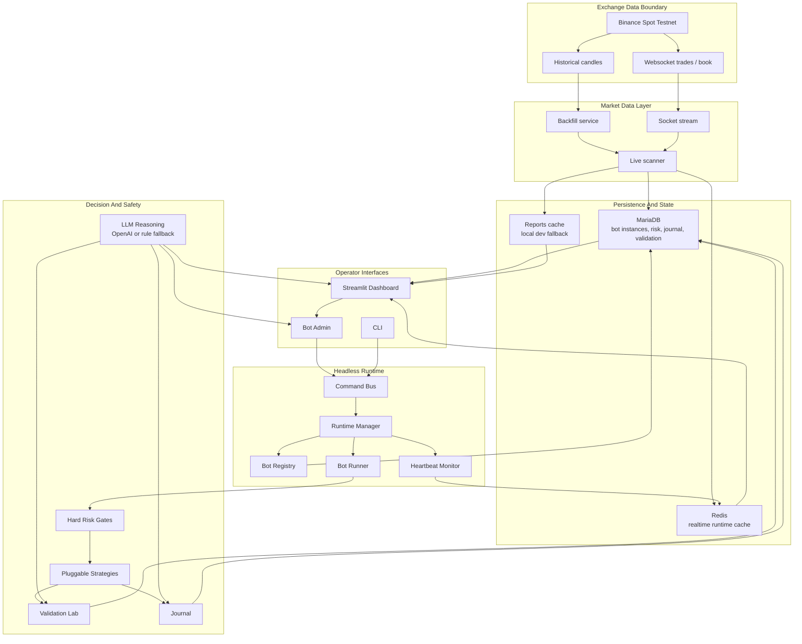
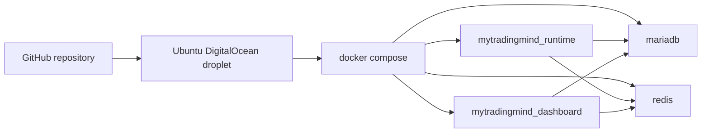

# mytradingmind.ai Architecture Overview

This diagram is the visitor-friendly map of how the platform is intended to operate. The dashboard is an operator console; bot execution is owned by the headless runtime and shared command bus.

## Core Responsibilities

- **Streamlit Dashboard**: visualization, configuration, Bot Admin controls, validation views, journal review, and operational health.
- **Bot Admin**: sends lifecycle commands through the shared command bus. It does not place exchange orders.
- **Command Bus**: normalizes runtime commands from UI and CLI, prevents duplicate commands, validates command shape, and routes actions to the runtime manager.
- **Headless Runtime**: owns bot state transitions, heartbeat state, runtime status, and 24x7 operation independent of browser sessions.
- **MariaDB**: durable source of truth for bot instances, risk settings, journal events, validation runs, scanner state, and replay metrics.
- **Redis**: intended low-latency cache for runtime status and live dashboard refresh.
- **LLM Reasoning**: explains, challenges, and summarizes decisions. If `OPENAI_API_KEY` is absent or `AEGIS_LLM_MODE=rules`, deterministic fallback rules are used.

## Safety Boundaries

- Strategies generate signals only.
- Bot Admin and CLI issue runtime commands only.
- Risk gates must approve any deployable runtime action.
- LLM output can explain or veto, but cannot place orders, bypass risk, or override execution.
- Live-money operation remains gated until testnet execution, reconciliation, restart recovery, and kill-switch drills are certified.

## Deployment Shape

