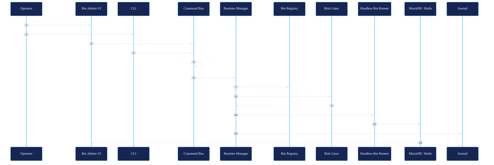
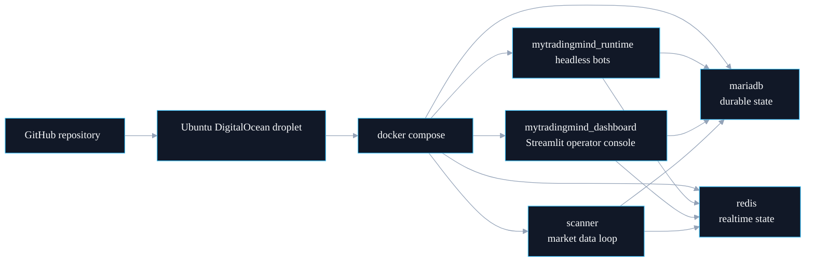

# mytradingmind.ai Architecture Overview

mytradingmind.ai is designed as a crypto-neutral, testnet-first trading operating system. The dashboard is only the operator cockpit; the runtime, command bus, persistence, validation, and safety gates are separate layers so bots can continue operating without a browser session.

## Layered System Architecture

```mermaid
%%{init: {"theme": "base", "themeVariables": {"background": "#07111f", "mainBkg": "#111827", "primaryColor": "#172554", "primaryTextColor": "#f8fafc", "primaryBorderColor": "#38bdf8", "lineColor": "#94a3b8", "secondaryColor": "#1e293b", "tertiaryColor": "#0f172a", "clusterBkg": "#0f172a", "clusterBorder": "#334155", "fontFamily": "Inter, Segoe UI, Arial, sans-serif"}} }%%
flowchart TB
    classDef exchange fill:#101820,stroke:#4cc9f0,color:#eef6ff,stroke-width:1px
    classDef ingest fill:#10251f,stroke:#5eead4,color:#eafffb,stroke-width:1px
    classDef compute fill:#1b2430,stroke:#93c5fd,color:#eef6ff,stroke-width:1px
    classDef safety fill:#2a1618,stroke:#fb7185,color:#fff1f2,stroke-width:1px
    classDef runtime fill:#251b12,stroke:#f59e0b,color:#fff7ed,stroke-width:1px
    classDef ui fill:#181827,stroke:#a78bfa,color:#f5f3ff,stroke-width:1px
    classDef store fill:#111827,stroke:#d1d5db,color:#f9fafb,stroke-width:1px
    classDef ai fill:#172554,stroke:#60a5fa,color:#eff6ff,stroke-width:1px

    subgraph L0["L0 - Exchange Boundary"]
        EX1["Binance Spot Testnet<br/>public market data"]
        EX2["Future Exchange Adapter<br/>live spot / futures extension"]
    end

    subgraph L1["L1 - Market Data Ingestion"]
        MD1["Historical Backfill<br/>1-year candles"]
        MD2["Live Scanner<br/>top configured crypto universe"]
        MD3["Websocket Stream<br/>trade ticks, order book, heartbeat"]
        MD4["Feed Health<br/>stale feed, reconnect, latency"]
    end

    subgraph L2["L2 - Data Normalization And Feature Layer"]
        F1["Bar Builder<br/>closed candles only"]
        F2["Feature Engine<br/>ATR, EMA, VWAP, RVOL, volatility"]
        F3["Orderflow Engine<br/>delta, CVD, spread, velocity, liquidity"]
        F4["Regime Engine<br/>trend, chop, compression, panic"]
    end

    subgraph L3["L3 - Strategy And Signal Layer"]
        S1["Strategy Registry<br/>reusable plugins"]
        S2["Bot Framework<br/>assemble bot from strategies"]
        S3["Signal Engine<br/>watch, buy, sell, in-trade states"]
        S4["Backtest Adapter<br/>same strategy contract"]
    end

    subgraph L4["L4 - Decision And Safety Layer"]
        C1["Consensus Engine<br/>regime + orderflow + strategy"]
        C2["Hard Risk Gates<br/>cash, exposure, frequency, kill switch"]
        C3["Orderflow Verifier<br/>required before trade approval"]
        C4["Protection Rules<br/>fail closed if unprotected"]
    end

    subgraph L5["L5 - Runtime Control Plane"]
        R1["Shared Command Bus<br/>idempotent lifecycle commands"]
        R2["Runtime Manager<br/>state transitions and audit"]
        R3["Bot Registry<br/>persistent bot definitions"]
        R4["Headless Bot Runner<br/>24x7 without UI"]
        R5["Heartbeat Monitor<br/>runtime and bot liveness"]
    end

    subgraph L6["L6 - Operator Experience"]
        U1["Dashboard<br/>global performance and charts"]
        U2["Live Trading<br/>signals, buckets, live ticks"]
        U3["Order Flow<br/>symbol guidance and liquidity insight"]
        U4["Risk<br/>portfolio controls and hard limits"]
        U5["Bot Framework<br/>create and configure bots"]
        U6["Bot Runtime<br/>live PnL and deployed bot tiles"]
        U7["Bot Admin<br/>start, stop, pause, resume"]
        U8["Journal<br/>decisions and strategy improvement"]
        U9["Validation Lab<br/>backtest and certification"]
        U10["System Health<br/>logs, connectivity, queues"]
    end

    subgraph L7["L7 - Persistence And Observability"]
        P1["MariaDB<br/>durable source of truth"]
        P2["Redis<br/>realtime state cache"]
        P3["Reports Cache<br/>local fallback and artifacts"]
        P4["Structured Logs<br/>diagnostics and audit trail"]
        P5["Journal Events<br/>why entered, skipped, blocked, failed"]
    end

    subgraph L8["L8 - LLM Reasoning Layer"]
        A1["Reasoning Agent<br/>explain, challenge, summarize"]
        A2["Consensus Reviewer<br/>concern score and veto"]
        A3["Trade Explainer<br/>journal commentary"]
        A4["Rule Fallback<br/>safe no-key operation"]
    end

    EX1 --> MD1
    EX1 --> MD2
    EX1 --> MD3
    EX2 -. future .-> MD3
    MD1 --> F1
    MD2 --> F2
    MD3 --> F3
    MD4 --> C2
    F1 --> F2
    F2 --> F4
    F3 --> C3
    F4 --> C1
    S1 --> S2
    S2 --> S3
    S3 --> C1
    S4 --> U9
    C1 --> C2
    C3 --> C2
    C2 --> C4
    C4 --> R4
    U7 --> R1
    CLI["CLI<br/>python -m mytradingmind.runtime"] --> R1
    R1 --> R2
    R2 --> R3
    R2 --> R4
    R2 --> R5
    R3 --> P1
    R5 --> P2
    R4 --> P5
    P1 --> U1
    P1 --> U4
    P1 --> U5
    P1 --> U8
    P1 --> U9
    P2 --> U2
    P2 --> U6
    P2 --> U10
    P3 --> U1
    P4 --> U10
    A1 --> U3
    A1 --> U7
    A2 --> C1
    A3 --> U8
    A4 --> A1

    class EX1,EX2 exchange
    class MD1,MD2,MD3,MD4 ingest
    class F1,F2,F3,F4,S1,S2,S3,S4,C1 compute
    class C2,C3,C4 safety
    class R1,R2,R3,R4,R5 runtime
    class U1,U2,U3,U4,U5,U6,U7,U8,U9,U10 ui
    class P1,P2,P3,P4,P5 store
    class A1,A2,A3,A4 ai
```

## Runtime And Control Architecture

## Data And Decision Flow

```mermaid
%%{init: {"theme": "base", "themeVariables": {"background": "#07111f", "mainBkg": "#111827", "primaryColor": "#172554", "primaryTextColor": "#f8fafc", "primaryBorderColor": "#38bdf8", "lineColor": "#94a3b8", "secondaryColor": "#1e293b", "tertiaryColor": "#0f172a", "fontFamily": "Inter, Segoe UI, Arial, sans-serif"}} }%%
flowchart LR
    A["Binance market data"] --> B["Scanner and websocket stream"]
    B --> C["Feature / orderflow / regime state"]
    C --> D["Strategy signal"]
    D --> E["Consensus review"]
    E --> F["Orderflow verifier"]
    F --> G["LLM or rule-based challenge"]
    G --> H["Hard risk gates"]
    H --> I{"Approved?"}
    I -- no --> J["Journal skipped or blocked trade"]
    I -- yes --> K["Runtime bot state updated"]
    K --> L["Dashboard / Bot Runtime / Bot Admin"]
```

## Component Responsibilities

| Layer | Components | Responsibility |
| --- | --- | --- |
| Exchange Boundary | Binance Spot Testnet, future adapters | Source of market data and eventual execution integration. |
| Market Data | Backfill, scanner, websocket stream | Capture candles, live prices, order book, and feed health. |
| Feature Layer | Feature, orderflow, regime engines | Produce centralized features so strategies do not compute private indicators. |
| Strategy Layer | Strategy registry, Bot Framework, signal engine | Build reusable bots from pluggable strategies and emit signals only. |
| Safety Layer | Consensus, risk, orderflow verifier, protection rules | Enforce fail-closed decisions before any deployable action. |
| Runtime Layer | Command bus, runtime manager, bot registry, runner, heartbeat | Keep bots running independently of Streamlit/browser lifecycle. |
| UI Layer | Dashboard, Live Trading, Order Flow, Risk, Bot Framework, Bot Runtime, Bot Admin, Journal, Validation Lab, System Health | Operate, visualize, administer, validate, and explain the system. |
| Persistence | MariaDB, Redis, reports cache, logs, journal | Persist durable state and provide low-latency operational visibility. |
| LLM Layer | Reasoning agent, consensus reviewer, explainer, fallback rules | Explain/challenge decisions; never places orders or bypasses risk. |

## Safety Boundaries

- Bot Admin and CLI send commands only through the shared command bus.
- The command bus performs idempotency and command-shape validation.
- Runtime Manager owns lifecycle state and audit logging.
- Strategies emit signals only and do not call the exchange.
- Risk gates are hard blocks, not advisory metrics.
- LLM may explain, challenge, score, and veto, but cannot place orders or override risk.
- The dashboard can be stopped without stopping the headless runtime.

## Deployment Shape

